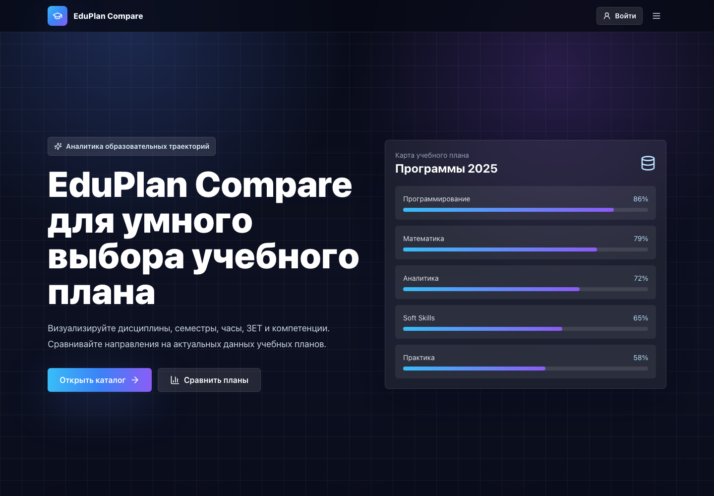
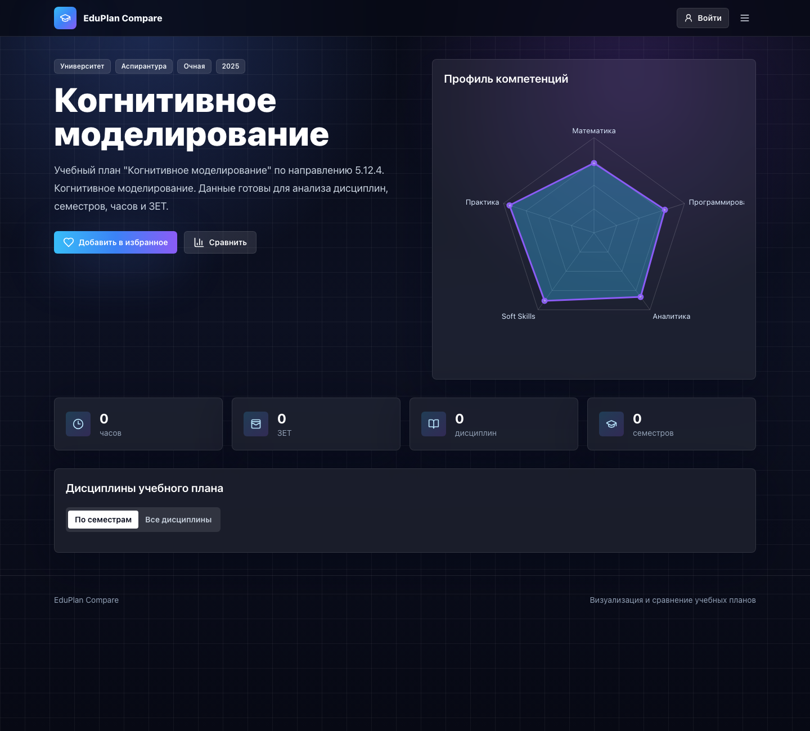
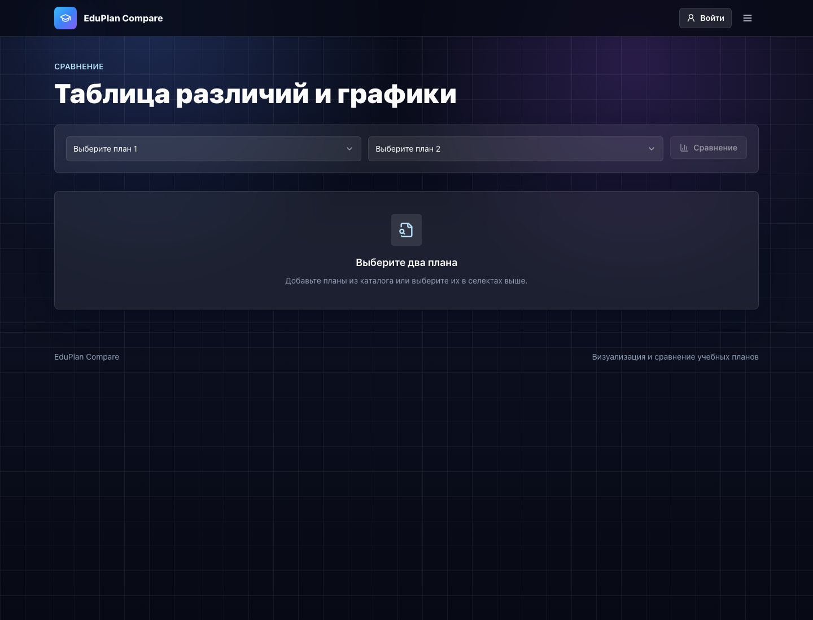

# EduPlan Compare

Веб-приложение для визуализации, поиска и сравнения учебных планов. Проект оформлен как монорепозиторий: React frontend получает данные из Express/Prisma backend, а backend хранит и обрабатывает учебные планы из FIT Excel-выгрузок.



## Возможности

- каталог учебных планов с поиском и фильтрами;
- детальная страница плана с дисциплинами по семестрам;
- radar chart компетенций направления;
- сравнение двух учебных планов с графиком и таблицей различий;
- регистрация, авторизация, профиль пользователя;
- избранное, история просмотров и список сравнения;
- Swagger-документация backend API;
- адаптивный dark university-tech интерфейс.

## Стек

| Часть    | Технологии                                                                                                            |
| -------- | --------------------------------------------------------------------------------------------------------------------- |
| Frontend | React, TypeScript, Vite, React Router, Tailwind CSS, CSS modules-by-component, Zustand, Axios, Recharts, lucide-react |
| Backend  | Node.js, Express, TypeScript, Prisma, PostgreSQL, JWT, Zod, Swagger UI                                                |
| Monorepo | npm workspaces, concurrently, Docker Compose                                                                          |

## Структура

```text
.
├── apps/
│   ├── frontend/        # React/Vite приложение
│   └── backend/         # Express API + Prisma
├── packages/
│   └── shared/          # место для общих пакетов
├── docs/                # подробная документация
├── docker-compose.yml
├── package.json
└── README.md
```

> Локальная папка `FIT/` с Excel-выгрузками игнорируется git и не должна попадать в репозиторий.

## Быстрый старт

```bash
cp .env.example .env
npm install
npm run prisma:generate
npm run prisma:migrate
npm run seed
npm run import:fit
npm run dev
```

После запуска:

| Сервис      | URL                              |
| ----------- | -------------------------------- |
| Frontend    | `http://localhost:5173`          |
| Backend API | `http://localhost:4000`          |
| Swagger     | `http://localhost:4000/api/docs` |
| Healthcheck | `http://localhost:4000/health`   |

## Команды

```bash
npm run dev             # frontend + backend + postgres
npm run dev:frontend    # только frontend
npm run dev:backend     # только backend
npm run build           # сборка frontend и backend
npm run lint            # lint frontend и backend
npm run test            # backend tests
npm run import:fit      # импорт учебных планов из FIT/
```

## Основные маршруты

| Route        | Назначение                        |
| ------------ | --------------------------------- |
| `/`          | главная страница                  |
| `/login`     | авторизация                       |
| `/register`  | регистрация                       |
| `/plans`     | каталог учебных планов            |
| `/plans/:id` | детальная страница учебного плана |
| `/compare`   | сравнение планов                  |
| `/profile`   | профиль пользователя              |

## Основные API endpoints

- `POST /api/auth/register`
- `POST /api/auth/login`
- `GET /api/auth/me`
- `GET /api/curricula`
- `GET /api/curricula/:id`
- `GET /api/comparison?firstCurriculumId=1&secondCurriculumId=2`
- `GET /api/profile/favorites`
- `GET /api/profile/history`

Подробнее: [docs/api.md](./docs/api.md).

## Документация

| Документ                                            | Описание                                  |
| --------------------------------------------------- | ----------------------------------------- |
| [architecture.md](./docs/architecture.md)           | архитектура и flow данных                 |
| [frontend.md](./docs/frontend.md)                   | frontend структура, компоненты, состояние |
| [backend.md](./docs/backend.md)                     | backend модули, Prisma, обработка данных  |
| [api.md](./docs/api.md)                             | API endpoints и примеры                   |
| [routing.md](./docs/routing.md)                     | frontend маршруты                         |
| [auth.md](./docs/auth.md)                           | авторизация и хранение токена             |
| [comparison-system.md](./docs/comparison-system.md) | система сравнения                         |
| [filters.md](./docs/filters.md)                     | архитектура фильтров                      |
| [styling.md](./docs/styling.md)                     | CSS/Tailwind стратегия                    |
| [deployment.md](./docs/deployment.md)               | build и deployment                        |
| [development.md](./docs/development.md)             | правила разработки                        |
| [screenshots.md](./docs/screenshots.md)             | скриншоты интерфейса                      |

## Скриншоты






## Качество

Перед изменениями и перед PR рекомендуется запускать:

```bash
npm run lint
npm run build
npm run test
```
