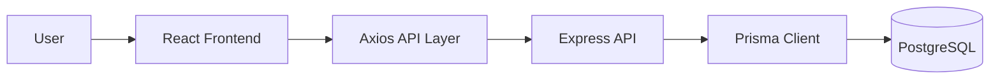
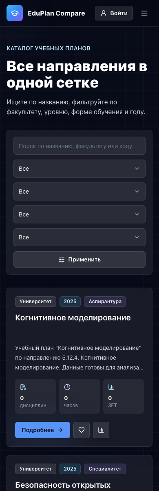

# EduPlan Compare

> Production-oriented web application for visualizing, browsing, and comparing university curricula.

EduPlan Compare is a monorepo with a React frontend and an Express/Prisma backend. It helps students, curriculum managers, and developers inspect curriculum structure, compare discipline differences, and understand program competency profiles.


## Documentation Map

| Document                                    | Purpose                                                     |
| ------------------------------------------- | ----------------------------------------------------------- |
| [Architecture](./architecture.md)           | System design, data flow, frontend/backend interaction      |
| [Frontend](./frontend.md)                   | React structure, components, state, charts, layout          |
| [Backend](./backend.md)                     | Express modules, Prisma models, import and comparison logic |
| [API](./api.md)                             | Endpoints, parameters, request/response examples            |
| [Routing](./routing.md)                     | Frontend route map and navigation behavior                  |
| [Auth](./auth.md)                           | Login, registration, token storage, logout                  |
| [Comparison System](./comparison-system.md) | Discipline diff algorithm and visualizations                |
| [Filters](./filters.md)                     | Frontend filter config and query sanitation                 |
| [Styling](./styling.md)                     | CSS variables, component CSS, Tailwind strategy             |
| [Deployment](./deployment.md)               | Builds, environment variables, Docker notes                 |
| [Development](./development.md)             | Local setup, scripts, conventions                           |
| [Screenshots](./screenshots.md)             | Real UI screenshots generated from the app                  |

## Features

- Curriculum catalog with search and frontend-owned filters.
- Curriculum detail page with disciplines grouped by semester.
- Radar chart for competency profile.
- Compare page with summary metrics, bar chart, and differences table.
- User auth with register/login/logout.
- Favorites, compare list, and view history state.
- Responsive desktop and mobile interface.
- API-driven data loading with a small fallback only for unavailable backend.

## Technology Stack

| Layer    | Technologies                                                                                                            |
| -------- | ----------------------------------------------------------------------------------------------------------------------- |
| Frontend | React, TypeScript, Vite, React Router, Tailwind CSS, shadcn-style UI primitives, lucide-react, Recharts, Zustand, Axios |
| Backend  | Node.js, Express, TypeScript, Prisma, PostgreSQL, Zod, JWT, Swagger UI                                                  |
| Monorepo | npm workspaces, concurrently, Docker Compose                                                                            |
| Tooling  | ESLint, TypeScript, Vite proxy, Prisma migrations                                                                       |

## Monorepo Structure

```text
.
├── apps/
│   ├── frontend/        # React/Vite UI
│   └── backend/         # Express API + Prisma
├── packages/
│   └── shared/          # Shared package placeholder
├── docs/                # Project documentation
├── docker-compose.yml   # PostgreSQL and optional services
├── package.json         # Root workspace scripts
└── package-lock.json
```

## Quick Start

```bash
npm install
npm run dev
```

The root `dev` command starts PostgreSQL through Docker Compose and runs frontend and backend in parallel.

| Service      | URL                              |
| ------------ | -------------------------------- |
| Frontend     | `http://localhost:5173`          |
| Backend API  | `http://localhost:4000`          |
| Swagger docs | `http://localhost:4000/api/docs` |
| Health check | `http://localhost:4000/health`   |

## Common Commands

```bash
npm run dev
npm run build
npm run lint
npm run test
npm run prisma:generate
npm run seed
npm run import:fit
```

## Main Pages

| Page         | Route        | Description                             |
| ------------ | ------------ | --------------------------------------- |
| Home         | `/`          | Product overview and entry point        |
| Login        | `/login`     | User authentication                     |
| Register     | `/register`  | Account creation                        |
| Plans        | `/plans`     | Curriculum catalog with filters         |
| Plan details | `/plans/:id` | Program stats, radar chart, disciplines |
| Compare      | `/compare`   | Curriculum diff and charts              |
| Profile      | `/profile`   | Favorites and view history              |

## Interface Preview


## Architecture Summary

Frontend communicates with backend through an Axios instance configured with `VITE_API_URL` or Vite proxy. The backend exposes REST endpoints under `/api/*`, validates requests with Zod, reads data through Prisma, and returns typed curriculum data. The frontend maps backend curriculum DTOs into UI-friendly `EducationPlan` objects and manages lightweight UI state with Zustand.



## Screenshots

More screenshots are available in [screenshots.md](./screenshots.md).


