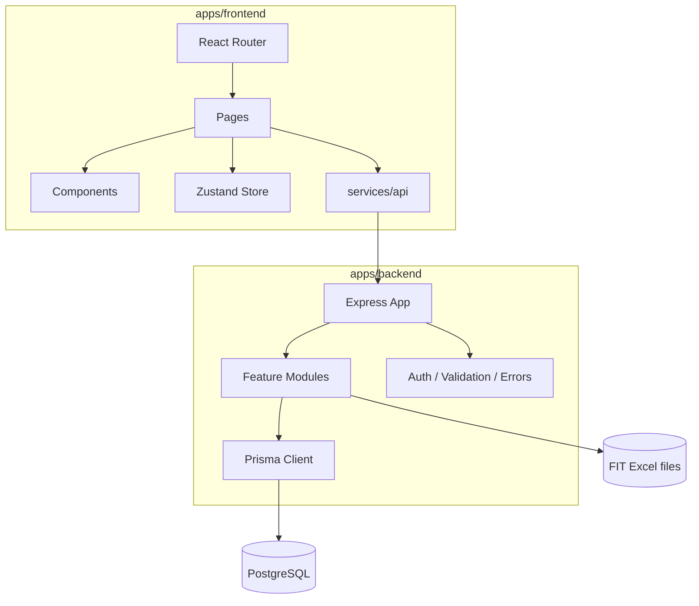
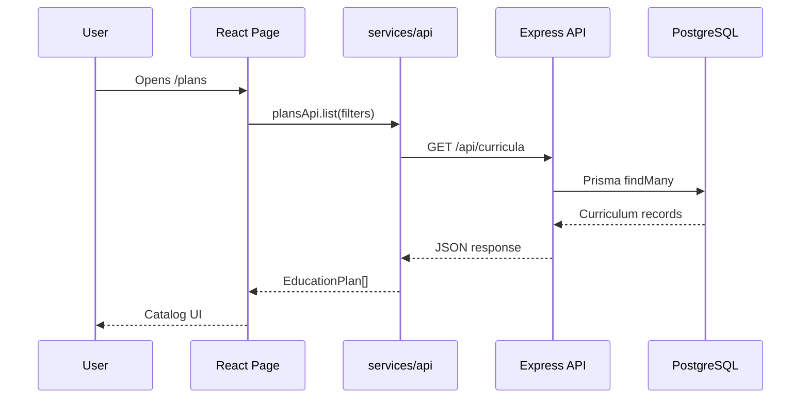

# Architecture

EduPlan Compare uses a workspace-based monorepo with a clear split between UI, API, and shared infrastructure.

## High-Level Diagram



## Monorepo Layout

| Path | Responsibility |
| --- | --- |
| `apps/frontend` | React application, UI state, routes, charts, API client |
| `apps/backend` | REST API, auth, validation, Prisma data access |
| `packages/shared` | Shared package placeholder for future cross-app contracts |
| `docs` | Developer and user documentation |

## Frontend and Backend Interaction

The frontend uses `services/api/client.ts` to create a single Axios instance. During development, Vite proxies `/api` and `/health` to `http://localhost:4000`. In production, `VITE_API_BASE_URL` must point to the deployed backend origin without `/api`.



## Data Flow

1. Route renders a page component.
2. Page calls a hook or service.
3. API service sanitizes query params and calls backend.
4. Backend validates request with Zod.
5. Backend module uses Prisma to read or write data.
6. Frontend maps backend DTOs to UI types.
7. Components render cards, tables, accordions, and charts.

## State Management

| State | Location | Persistence |
| --- | --- | --- |
| Auth user | `store/useAppStore.ts` | `localStorage` as `eduplan-user` |
| JWT token | `localStorage` | `eduplan-token` |
| Favorites | Zustand | `localStorage` |
| Compare IDs | Zustand | `localStorage` |
| View history | Zustand | In-memory for current frontend session |
| Filters | `usePlans` hook | Component state |

## Routing

React Router defines routes in `src/App.tsx`. The app currently does not block unauthenticated users from viewing profile, but backend profile endpoints require authentication.

## Backend Structure

Backend modules follow a conventional Express feature layout:

```text
modules/
  auth/
  curricula/
  comparison/
  profile/
  files/
  downloads/
  disciplines/
  specialities/
  users/
```

Each module generally contains routes, controller, service, and DTO validation files.

## Scaling Principles

- Keep backend modules isolated by domain.
- Keep frontend components colocated with component CSS.
- Keep API request logic in `services/api`.
- Keep UI filter options in frontend config, not derived from backend payload shape.
- Add shared types to `packages/shared` only when both apps need the same contract.
- Introduce route-level code splitting if bundle size becomes a deployment concern.
