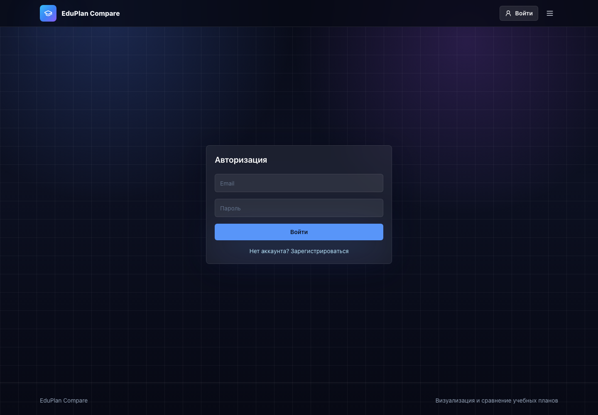
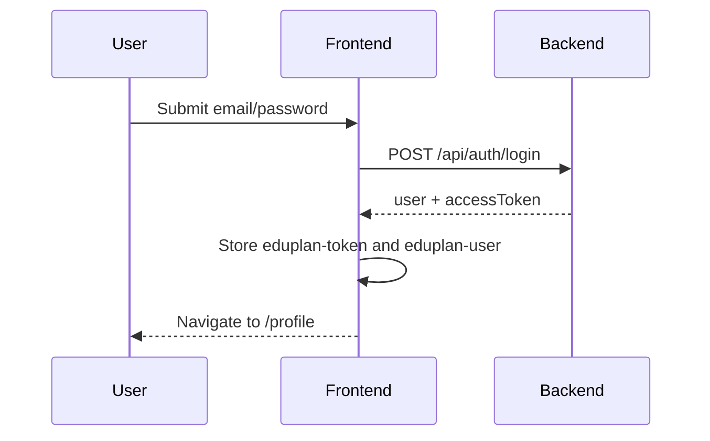
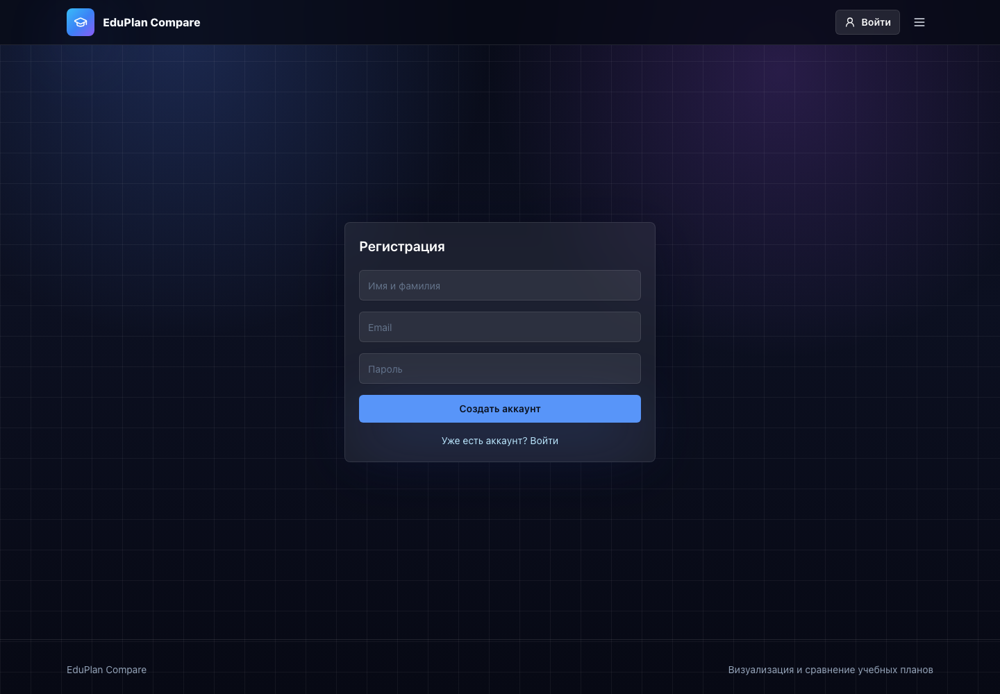

# Authentication

The app supports registration, login, token-based API authentication, persisted auth state, and logout.



## Login Flow



## Register Flow

Registration calls `POST /api/auth/register` and receives the same response shape as login.



## Local Storage

| Key | Value |
| --- | --- |
| `eduplan-token` | JWT access token |
| `eduplan-user` | Public user profile |

On app startup, `App.tsx` checks for `eduplan-token` and calls `/api/auth/me`. If validation fails, logout clears stored state.

## Axios Auth Header

`services/api/client.ts` attaches the token:

```ts
config.headers.Authorization = `Bearer ${token}`;
```

## Header Behavior

| State | Header Shows |
| --- | --- |
| Guest | Login button |
| Authenticated | Profile icon with dropdown |

Profile dropdown contains only:

- `Профиль`;
- `Выйти`.

## Logout

Logout:

1. removes `eduplan-token`;
2. removes `eduplan-user`;
3. clears Zustand `user`;
4. redirects to home.

## Security Considerations

- Tokens are currently stored in `localStorage`, which is simple but exposed to XSS.
- Production deployments should enforce HTTPS.
- Backend protected endpoints must always validate JWT server-side.
- Avoid storing sensitive user fields in `eduplan-user`.
