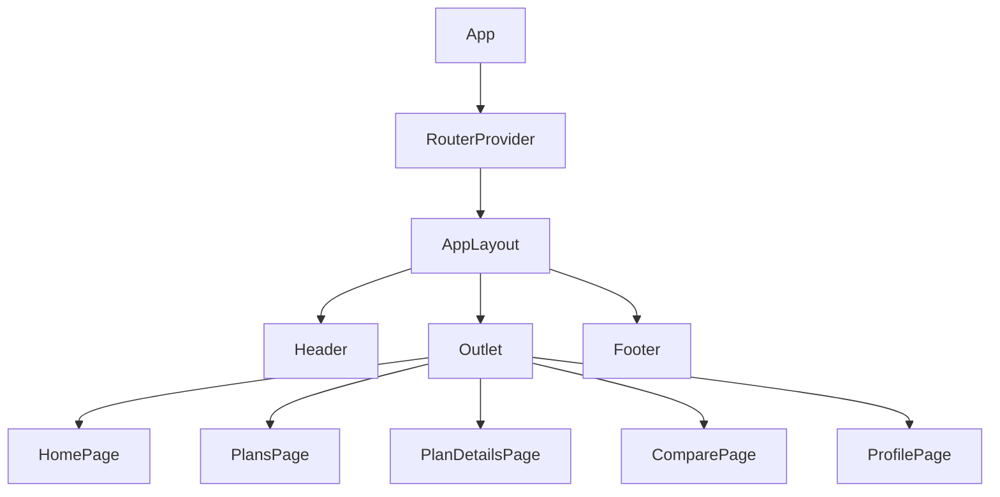

# Frontend

The frontend is a React + TypeScript + Vite application located in `apps/frontend`.


## Structure

```text
apps/frontend/src/
├── App.tsx
├── components/
│   ├── Header/
│   ├── PlanCard/
│   ├── SearchFilters/
│   ├── CompareTable/
│   └── ui/
├── constants/
├── hooks/
├── layouts/
├── pages/
├── services/
│   └── api/
├── store/
├── styles/
├── types/
└── utils/
```

## Pages

| Page | File | Route |
| --- | --- | --- |
| Home | `pages/HomePage/HomePage.tsx` | `/` |
| Auth | `pages/AuthPage/AuthPage.tsx` | `/login`, `/register` |
| Plans | `pages/PlansPage/PlansPage.tsx` | `/plans` |
| Details | `pages/PlanDetailsPage/PlanDetailsPage.tsx` | `/plans/:id` |
| Compare | `pages/ComparePage/ComparePage.tsx` | `/compare` |
| Profile | `pages/ProfilePage/ProfilePage.tsx` | `/profile` |

## Component Model

Large components are colocated with CSS:

```text
components/
  PlanCard/
    PlanCard.tsx
    PlanCard.css
  SearchFilters/
    SearchFilters.tsx
    SearchFilters.css
```

Small reusable UI primitives live in `components/ui`. They follow shadcn-style composition and wrap Radix primitives where useful.

## API Services

All backend calls live in `services/api`.

| File | Responsibility |
| --- | --- |
| `client.ts` | Axios instance, auth header interceptor |
| `plans.ts` | Curricula listing, details, compare, recommendations |
| `planMapper.ts` | Backend curriculum DTO to frontend plan mapping |
| `auth.ts` | Login, register, current user, logout storage cleanup |
| `profile.ts` | Favorites and history endpoints |

## State

Zustand store: `store/useAppStore.ts`.

```ts
type AppState = {
  user: UserProfile | null;
  favorites: number[];
  compareIds: number[];
  history: EducationPlan[];
};
```

The store persists user, token-adjacent profile data, favorites, and compare IDs in `localStorage`.

## Filters

Filters are generated from loaded plans in `utils/planFilters.ts`. `SearchFilters` still receives config through props, but options now reflect real API data instead of a static list.

```tsx
const { filterConfig, filters, setFilters, reload } = usePlans();

<SearchFilters
  config={filterConfig}
  filters={filters}
  onChange={setFilters}
  onSubmit={() => reload(filters)}
/>
```

## Charts

The app uses Recharts:

- `RadarStatsCard` renders `RadarChart` for program competencies.
- `ComparePage` renders `BarChart` for summary comparison.

## Layout Tree



## Responsive Layout

The design uses CSS media queries and Tailwind utilities. Header navigation is intentionally placed in the burger menu on both desktop and mobile to avoid duplicated navigation.
