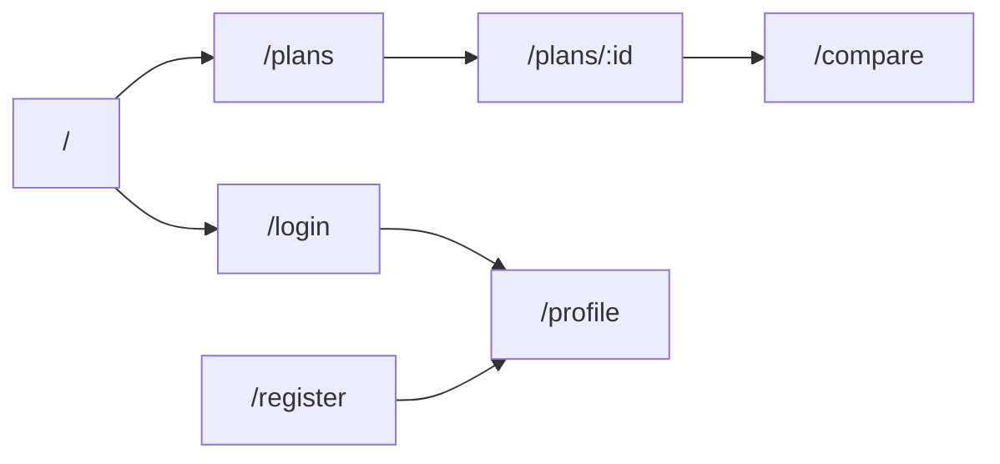

# Routing

Routing is defined in `apps/frontend/src/App.tsx` with React Router.

## Route Table

| Route | Page | Purpose |
| --- | --- | --- |
| `/` | `HomePage` | Main product page |
| `/login` | `AuthPage` | Login form |
| `/register` | `AuthPage` | Registration form |
| `/plans` | `PlansPage` | Curriculum catalog |
| `/plans/:id` | `PlanDetailsPage` | Curriculum details |
| `/compare` | `ComparePage` | Compare curricula |
| `/profile` | `ProfilePage` | User profile, favorites, history |
| `*` | `Navigate` | Redirect to home |

## Navigation

The header keeps the visible top bar minimal:

- project logo/name;
- burger menu;
- profile icon for authenticated users;
- login button for guests.

Main navigation lives in the burger menu:

- Главная;
- Учебные планы;
- Сравнение.

## Auth Routes

`/login` and `/register` use the same `AuthPage` wrapper with different `mode` props.

```tsx
<AuthPage mode="login" />
<AuthPage mode="register" />
```

## Profile Route

The profile page is visible in the frontend route table, but backend profile data requires a token. The UI encourages guests to sign in.

## Navigation Flow


